# Super Sales Suite (SX3)

Super Sales Suite is a **real estate AI SaaS** built for speed, trust, and automation.  
It connects AI assistants, onboarding, and sales tools into one event-driven system.

---

## 🚀 Architecture

The system is designed as a **nervous system**:

```mermaid
flowchart TD
  UI["UI (Next.js • Vercel)<br/>Home • Onboarding • Dashboard • Assistant"]:::blk

  subgraph CORE["AI Core (Intent → Plan → Actions → Review)"]
    AIC["AI Copilot"]
  end

  subgraph BUS["Event Bus & Orchestration"]
  end

  subgraph SVC["Services"]
    PRJ["Projects Library<br/>(per market)"]
    BR["Brand Kit<br/>(logo • colors • contacts)"]
    CR["Creative Tools<br/>PDF • Social • Reels • Landing"]
    ADS["Ads Manager<br/>Creator • Precision • Copilots"]
    CM["Comms & Outreach<br/>Email • WhatsApp • IG Bot"]
  end

  subgraph DATA["Data Layer (Firestore • Storage)"]
    DB["users • projects_catalog • projects_library • events • drafts"]
  end

  subgraph JOBS["Background Jobs (Cloud Functions)"]
    J1["generate library"]
    J2["sync brand"]
    J3["schedule chains"]
    J4["integrations"]
  end

  UI --> BUS --> CORE --> SVC
  SVC --> DATA
  SVC --> JOBS

  classDef blk fill:#0A0A0A,stroke:#7A7A7A,color:#EAEAEA,rx:12,ry:12;
  classDef ring fill:#0F0F0F,stroke:#95FE54,color:#95FE54,rx:10,ry:10;
  class CORE ring;
  class BUS blk;
  class SVC blk;
  class DATA blk;
  class JOBS blk;
```

---

## 🧩 Features

- **DeepSearch Onboarding** → location detect → dev focus → project scan → shortlist → brand setup → dashboard ready.  
- **AI Copilot** → multi-step assistants that chain tasks.  
- **No Demo Mode** → all content is generated live from real projects, city-based.  
- **Event-Driven Learning** → every click trains the system, no manual QA.  

---

## 🛠️ Developer Notes

- Files to watch:
  - `src/lib/events.ts` → fire analytics events
  - `src/lib/projects.ts` → fetch catalog
  - `src/lib/onboardingDraft.ts` → persist onboarding
  - `src/lib/market.ts` → market/pricing helpers
  - `src/lib/cards.config.ts` → UI card registry

- API Endpoints:
  - `/api/projects/suggest`
  - `/api/projects/scan`
  - `/api/shortlist`
  - `/api/brand`
  - `/api/payment`

---

## 📊 Analytics

The system tracks these key events:

- `onboarding_location_confirmed`  
- `onboarding_developers_selected`  
- `onboarding_firstpass_labeled`  
- `onboarding_scan20_completed`  
- `onboarding_shortlist_finalized`  
- `onboarding_brand_created`  
- `onboarding_completed`

Each event includes `{ uid, city, ts, payload }`.

---
---

 Status

- Core architecture complete  
- Onboarding flow complete
- AI copilots expanding  
- White-label prep  
- Ready for partner pilots
